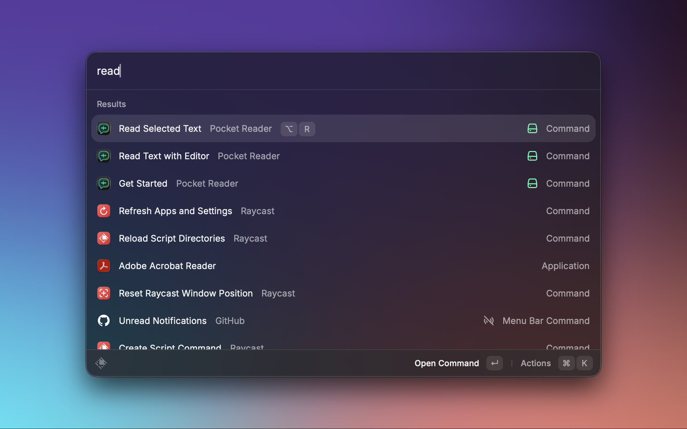

<div align="center">

# TTS Reader


*Turn any selected text into speech using any TTS provider, directly from Raycast.*

</div>

---

## Why This Extension Exists

I'm dyslexic (shoutout to fellow dyslexics! 👋), and I just wanted something that could read any text to me. Whether I'm browsing the web, in Slack, poking around Cursor agent chats, or anywhere else on my Mac.

The built-in Mac and Chrome voices are still stuck in the uncanny valley, so I built this with the goal of high-quality local text-to-speech for *any* selected text, anywhere on your system—right from Raycast. Enjoy!

---

## Features

* **Provider Agnostic** – Works with any TTS server that accepts `POST /tts` with a `text` form field.
* **Voice Control** – Pass a voice name to the server via preferences.
* **Speed & Format Options** – Adjust playback speed and output format (requires ffmpeg for non-WAV or speed changes).
* **Audio File Management** – Option to save generated audio files to `~/.cache/raycast-tts/` for debugging and reuse.
* **Feedback** – Shows progress during generation and surfaces errors clearly.

---

## Installation

Install from the Raycast Store by searching for "TTS Reader".

### Commands Available

* **"Get Started"** – Onboarding and configuration help
* **"Read Selected Text"** – Immediately reads the selected text or clipboard content
* **"Read Text with Editor"** – Opens text editor for reviewing and editing text before reading aloud

---

## Requirements

**TTS Server**

You need a running TTS server. A recommended example is [tts-gateway](https://github.com/abpai/tts-gateway):

```bash
uv tool install tts-gateway[kokoro]
tts serve --provider kokoro
```

Any server that accepts `POST /tts` with a `text` form field and returns audio will work.

**Optional (speed/format)**

* Install `ffmpeg` if you want non-WAV output or playback speed changes.

---

## Accessing Settings

To configure the extension:

1. Open **Raycast Settings** (`Cmd + ,`)
2. Navigate to **Extensions** tab
3. Find **TTS Reader** in the list
4. Click the extension name to open its settings panel
5. Configure your preferences (server URL, voice, etc.)



**Pro Tip:** Set a hotkey like `Option + R` for the "Read Selected Text" command for quick access from any application.

All changes are saved automatically and take effect immediately.

---

## Configuration Options

| Preference          | Type / Default               | Description                                                        |
| ------------------- | ---------------------------- | ------------------------------------------------------------------ |
| `serverUrl`         | Text – `http://localhost:8000` | TTS server endpoint URL.                                         |
| `voice`             | Text – empty                 | Voice name to pass to the TTS server.                              |
| `speed`             | Text – `1.0`                 | Playback speed (0.25–4.0). Requires ffmpeg when not 1.0.           |
| `outputFormat`      | Dropdown – `wav`             | Output format. Requires ffmpeg when not WAV.                       |
| `saveAudioFiles`    | Checkbox – `false`           | Save generated audio files for debugging/reuse.                    |

---

## Usage

### Basic Usage

1. **Select text** in any app — or — copy text to the clipboard.
2. Open Raycast and run **"Read Selected Text"**.
3. Audio generation begins and plays automatically.

### With Editor

1. Run **"Read Text with Editor"** to review/edit text before reading.
2. Press **Enter** or click **"Read Aloud"**.

### More Options

* Playback speed from 0.25x to 4.0x
* Output as WAV, MP3, M4A, or FLAC (ffmpeg required for non-WAV)
* Enable "Save Audio Files" to keep generated speech in `~/.cache/raycast-tts/`

---

## Audio File Management

* By default, audio files are temporary and cleaned up after playback.
* Enable "Save Audio Files" to keep them in `~/.cache/raycast-tts/`.
* File extensions match your selected format.
* Playback uses macOS's built-in `afplay`.

---

## Troubleshooting

### Server Connection Errors

1. Confirm your TTS server is running.
2. Check the server URL in preferences (default: `http://localhost:8000`).

### Speed / Format Issues

1. Install `ffmpeg` if using non-WAV output or playback speed changes.
2. Use WAV if you want to avoid ffmpeg entirely.

### File Issues

1. Check `~/.cache/raycast-tts/` if saving is enabled.
2. Verify file extensions match the selected format.
3. Test saved files manually: `afplay ~/.cache/raycast-tts/filename.wav`

---

## License

MIT © 2025-2026 Andy Pai – Always disclose AI-generated speech to users when appropriate.
